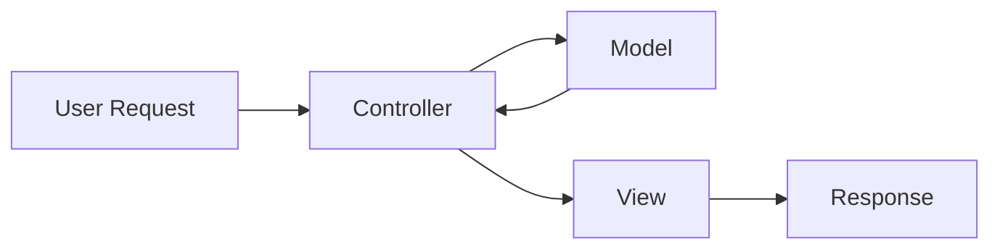
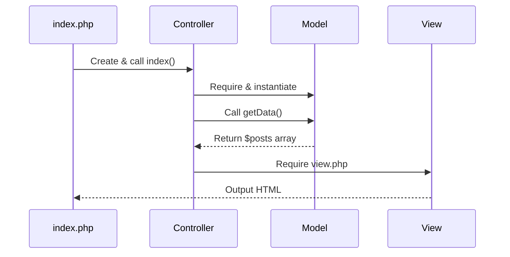

# Refactoring to MVC Pattern

Converting Plain PHP to Model-View-Controller Architecture

---
layout: two-cols
---

# Starting Point

Plain PHP script mixing logic and presentation

```php
<?php
// Database connection and query
$host = 'db';
$dbname = 'web3400';
$username = 'web3400';
$password = 'password';

$dsn = "mysql:host=$host;dbname=$dbname;charset=UTF8";
$pdo = new PDO($dsn, $username, $password, [
    PDO::ATTR_ERRMODE            => PDO::ERRMODE_EXCEPTION,
    PDO::ATTR_DEFAULT_FETCH_MODE => PDO::FETCH_ASSOC,
]);

$stmt = $pdo->query("SELECT * FROM posts");
$posts = $stmt->fetchAll();
?>
<!DOCTYPE html>
<html>
<head>
    <title>Blog Posts</title>
    <meta charset="UTF-8">
</head>
<body>
<h1>Blog Posts</h1>

<?php foreach ($posts as $post): ?>
    <h2><?= htmlspecialchars($post["title"]) ?></h2>
    <p><?= htmlspecialchars($post["body"]) ?></p>
<?php endforeach; ?>

</body>
</html>
```

::right::

# Problems

- **Mixed concerns**: Database logic + HTML in one file
- **Hard to maintain**: Changes require editing multiple sections
- **Not reusable**: Logic can't be shared across pages
- **Testing difficulties**: Can't test logic independently
- **Violates separation of concerns**

## Goal

Split the code to follow the **MVC pattern**


---

# What is MVC?

Model-View-Controller Design Pattern

<div class="grid grid-cols-3 gap-4 mt-8">

<div v-click>

## Model
**Handles Data**

- Database queries
- Business logic
- Data validation
- Returns data

</div>

<div v-click>

## View
**Handles Display**

- HTML templates
- Presentation logic
- User interface
- Output formatting

</div>

<div v-click>

## Controller
**Handles Flow**

- Coordinates M & V
- Processes requests
- Application logic
- Decision making

</div>

</div>

<div class="mt-8 text-center" v-click>



</div>


---

# Step 1: Create the Model

Extract data logic into a class

- Create new file: `model.php`
- Define a `Model` class
- Add `getData()` method
- Move database code into method
- Return the data

```php
<?php

class Model
{
    public function getData(): array
    {
        $host = 'db';
        $dbname = 'web3400';
        $username = 'web3400';
        $password = 'password';

        $dsn = "mysql:host=$host;dbname=$dbname;charset=UTF8";
        $pdo = new PDO($dsn, $username, $password, [
            PDO::ATTR_ERRMODE            => PDO::ERRMODE_EXCEPTION,
            PDO::ATTR_DEFAULT_FETCH_MODE => PDO::FETCH_ASSOC,
        ]);

        $stmt = $pdo->query("SELECT * FROM posts");

        return $stmt->fetchAll();
    }
}
```


---

# PHP Naming Conventions

Following PSR (PHP Standard Recommendations)

## Classes: StudlyCaps
```php
class Model        // ✓ Correct
class model        // ✗ Wrong
class MODEL        // ✗ Wrong
```

## Methods: camelCase
```php
public function getData()        // ✓ Correct
public function get_data()       // ✗ Wrong
public function GetData()        // ✗ Wrong
```

<div class="mt-4 p-4 bg-blue-50 dark:bg-blue-900 rounded">

**PSR** = Industry standard recommendations for PHP code structure

</div>


---

# Step 2: Update Index Script

Use the Model class

<div class="grid grid-cols-2 gap-4">

<div v-click>

## Before
```php
<?php
$host = 'db';
$dbname = 'web3400';
$username = 'web3400';
$password = 'password';

$dsn = "mysql:host=$host;
       dbname=$dbname;charset=UTF8";

$pdo = new PDO($dsn, $username, $password, [
    PDO::ATTR_ERRMODE =>
        PDO::ERRMODE_EXCEPTION,
    PDO::ATTR_DEFAULT_FETCH_MODE =>
        PDO::FETCH_ASSOC,
]);

$stmt = $pdo->query(
    "SELECT * FROM posts");

$posts = $stmt->fetchAll();
?>
<!DOCTYPE html>
<!-- HTML here -->
```

</div>

<div v-click>

## After
```php
<?php
require "model.php";

$model = new Model;

$posts = $model->getData();

?>
<!DOCTYPE html>
<!-- HTML here -->
```

<div class="mt-4 p-3 bg-green-50 dark:bg-green-900 rounded text-sm">

✓ Much cleaner!<br>
✓ Same variable name (`$posts`)<br>
✓ HTML loop works without changes

</div>

</div>

</div>

---

# Testing the Model

Verify it works as before

1. Open the page in browser
2. Check that posts display correctly
3. **Nothing has changed** from user perspective
4. But the code is now better organized!

<div class="mt-8 text-center">

## Same Output, Better Code

This is successful **refactoring**

</div>


---

# Step 3: Create the View

Separate presentation from logic

- Create new file: `view.php`
- Move HTML code into it
- Keep the `foreach` loop
- Remove PHP logic (already in Model)

```php
<!DOCTYPE html>
<html>
<head>
    <title>Blog Posts</title>
    <meta charset="UTF-8">
</head>
<body>

<h1>Blog Posts</h1>

<?php foreach ($posts as $post): ?>

    <h2><?= htmlspecialchars($post["title"]) ?></h2>
    <p><?= htmlspecialchars($post["body"]) ?></p>

<?php endforeach; ?>

</body>
</html>
```


---

# Step 4: Create the Controller

Coordinate Model and View

- Create new file: `controller.php`
- Define a `Controller` class
- Add `index()` method
- Require the Model
- Get data from Model
- Require the View

```php
<?php

class Controller
{
    public function index()
    {
        require "model.php";

        $model = new Model;

        $posts = $model->getData();

        require "view.php";
    }
}
```


---

# Step 5: Update Index Script

Simplify to just call Controller

<div class="grid grid-cols-2 gap-4">

<div v-click>

## Before (with Model only)
```php
<?php
require "model.php";

$model = new Model;

$posts = $model->getData();

?>
<!DOCTYPE html>
<html>
<head>
    <title>Blog Posts</title>
    <meta charset="UTF-8">
</head>
<body>
<!-- HTML... -->
</body>
</html>
```

</div>

<div v-click>

## After (full MVC)
```php
<?php

require "controller.php";

$controller = new Controller;

$controller->index();
```

<div class="mt-4 p-3 bg-green-50 dark:bg-green-900 rounded text-sm">

✓ Super clean!<br>
✓ Just 3 lines of logic<br>
✓ Everything delegated properly

</div>

</div>

</div>

---

# Complete File Structure

All components working together

```
project/
├── index.php           # Entry point - creates Controller
├── controller.php      # Controller class - coordinates flow
├── model.php          # Model class - handles data
└── view.php           # View template - displays HTML
```

## Flow of Execution




---
layout: two-cols
---

# Before: Monolithic

Single file doing everything

```php
<?php
// Database connection
$host = 'db';
$dbname = 'web3400';
$username = 'web3400';
$password = 'password';

$dsn = "mysql:host=$host;dbname=$dbname;charset=UTF8";
$pdo = new PDO($dsn, $username, $password, [
    PDO::ATTR_ERRMODE            => PDO::ERRMODE_EXCEPTION,
    PDO::ATTR_DEFAULT_FETCH_MODE => PDO::FETCH_ASSOC,
]);

// Query
$stmt = $pdo->query("SELECT * FROM posts");
$posts = $stmt->fetchAll();
?>
<!DOCTYPE html>
<html>
<head>
    <title>Blog Posts</title>
</head>
<body>
<h1>Blog Posts</h1>
<?php foreach ($posts as $post): ?>
    <h2><?= $post["title"] ?></h2>
    <p><?= $post["body"] ?></p>
<?php endforeach; ?>
</body>
</html>
```

::right::

# After: MVC

Separated concerns

**index.php**
```php
<?php
require "controller.php";
$controller = new Controller;
$controller->index();
```

**model.php**
```php
<?php
class Model {
    public function getData(): array {
        // DB logic
        return $data;
    }
}
```

**controller.php**
```php
<?php
class Controller {
    public function index() {
        $model = new Model;
        $data = $model->getData();
        require "view.php";
    }
}
```

**view.php**
```php
<!-- HTML only -->
```

---

# Benefits of MVC

Why this pattern matters

## 1. Separation of Concerns
Each component has **one job** and does it well

## 2. Maintainability
Easy to find and fix issues - know exactly where to look

## 3. Reusability
Model can be used by multiple controllers/views

## 4. Testability
Can test Model independently of HTML

## 5. Team Collaboration
Different developers can work on M, V, or C simultaneously

## 6. Scalability
Easy to add new features without breaking existing code

---

# Key Takeaways

What we learned

1. **MVC separates** data (Model), display (View), and logic (Controller)

2. **Models** handle database operations and return data

3. **Views** contain only HTML and presentation logic

4. **Controllers** coordinate between Models and Views

5. **Refactoring** improves code without changing behavior

6. Follow **PSR standards**: StudlyCaps for classes, camelCase for methods

7. Same output, better organized code = **successful refactoring**

<div class="mt-8 text-center text-2xl font-bold">

Start simple → Refactor to MVC → Scale confidently

</div>


---
layout: center
class: text-center
---

# Questions?

Understanding the MVC pattern in PHP

<div class="mt-8">

Next steps:
- Try refactoring your own scripts
- Add more methods to Model
- Create multiple controllers
- Build more complex applications

</div>
