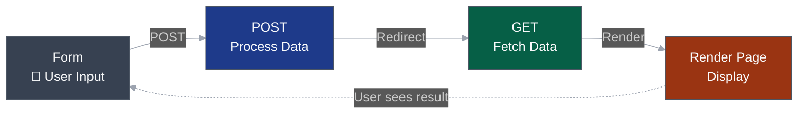
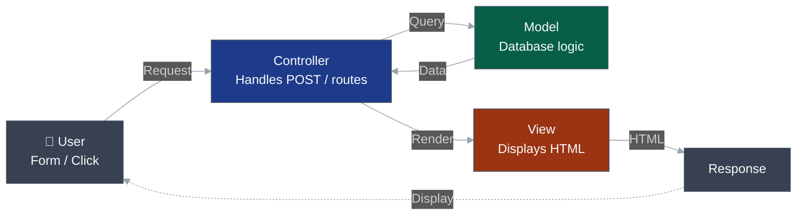
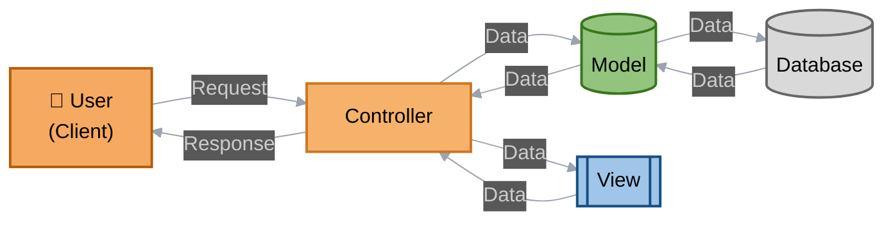

<style>
/* Progress bar styling */
.slidev-progress {
  background: linear-gradient(90deg, #3b82f6 0%, #8b5cf6 100%);
  height: 3px;
}

/* Slide number styling */
.slidev-page-footer {
  display: flex;
  justify-content: space-between;
  align-items: center;
  padding: 1rem 2rem;
  font-size: 0.875rem;
  color: #64748b;
}

.slidev-page-footer .slidev-page-number {
  font-weight: 600;
  color: #475569;
}

.slidev-layout {
  overflow-y: auto !important;
  height: 100%;
}
</style>

# From PRG to MVC  
### Evolving from Spaghetti PHP to Structured Design

<!--
🗣️ Speaker Notes:
This lecture connects what students have just built – their CRUD project using the PRG pattern – to where we're going next: building an MVC framework from scratch.
The goal is to show that MVC isn't something new to fear; it's simply a cleaner, more structured version of what they're already doing.
-->

---

## Where We've Been – The PRG Pattern

**PRG = Post → Redirect → Get**

```text
Form → POST → Process → Redirect → GET → Render
```

✅ Prevents duplicate submissions  
✅ Improves user experience  
✅ Keeps the browser's back button safe  

<!--
🗣️ Speaker Notes:
Remind students of how PRG solved the "resubmit form on refresh" issue.
It also introduced a basic request–response flow, which becomes crucial for understanding MVC.
-->

---

## The PRG Flow (Visually)
<br><br><br>


---

## Why Change? (Pain Points)

Even with PRG:

- Logic, SQL, and HTML live together  
- Repeated code across pages  
- Difficult to debug  
- Hard to reuse functions between features  

💭 *What's one file in your project that grew out of control?*

---

## Code Example: Your Project 01

```php {all|5-9|11-14|16-20|all}
<?php
// blog_create.php - Everything in one file (200+ lines)

require __DIR__ . '/config.php';
$pageTitle = 'Create Post';

// VALIDATION + LOGIC + DATABASE + REDIRECT all together
if ($_SERVER['REQUEST_METHOD'] === 'POST') {
    $title = trim($_POST['title'] ?? '');
    $body = trim($_POST['body'] ?? '');
    
    $errors = [];
    if ($title === '' || mb_strlen($title) < 3) {
        $errors['title'] = 'Title is required (min 3 chars).';
    }
    
    if (!$errors) {
        $slug = slugify($title);
        $stmt = $pdo->prepare("INSERT INTO posts (title, slug, body) VALUES (?, ?, ?)");
        $stmt->execute([$title, $slug, $body]);
        flash('Post created.', 'is-success');
        header('Location: admin_blog.php'); 
        exit;
    }
}
?>
<?php require __DIR__ . '/templates/head.php'; ?>
<!-- 100 more lines of HTML form... -->
```

🤔 **Where would you debug if something breaks?**

---

## Transitioning the Flow – PRG → MVC

<br><br><br>
<v-clicks>



</v-clicks>

---

## Mapping PRG → MVC

| PRG Step | MVC Role | Example in Project 01 |
|-----------|-----------|-----------------------|
| **POST → Process** | **Controller** | The code that handled `$_POST`, validated input, and decided what to do next |
| **Database Query / Insert** | **Model** | Your PDO `INSERT` or `SELECT` queries inside the same file |
| **Redirect (header)** | **Controller → View** | Controller chooses which page (view) to display or redirect to |
| **GET → Render Page** | **View** | The final HTML mixed with PHP output |
| **Form Submission / Input** | **User Action → Controller** | What triggers the MVC request cycle |

💡 *MVC doesn't replace PRG – it formalizes it.*

---

## Code Comparison: PRG vs MVC

<div class="grid grid-cols-2 gap-4">

<div>

### Before (PRG - blog_create.php)
```php {all|3-5|8-11|14|all}
// All in one file
if ($_SERVER['REQUEST_METHOD'] === 'POST') {
    $title = trim($_POST['title'] ?? '');
    $body = trim($_POST['body'] ?? '');
    
    // Validation
    if ($title === '') {
        $errors[] = "Title required";
    }
    
    // Database
    $stmt = $pdo->prepare(
        "INSERT INTO posts..."
    );
    $stmt->execute([$title, $body]);
    
    // Redirect
    header('Location: admin_blog.php');
}
// HTML form below...
```

</div>

<div>

### After (MVC)
```php {all|3-6|9|12|all}
// Controller
public function create() {
    if ($_POST) {
        $data = $_POST;
        
        // Model handles DB
        $this->postModel->create($data);
        
        // Router handles redirect
        redirect('admin/posts'); 
    }
    
    // View handles HTML
    $this->view('posts/create');
}
```

</div>

</div>

💡 *Same logic, separated concerns*

---

## File Structure: Then vs Now

<div class="grid grid-cols-2 gap-8">

<div>

### Project 01 (PRG)
```text
/project-01
  index.php (mixed)
  blog_create.php (mixed)
  blog_edit.php (mixed)
  blog_delete.php (mixed)
  blog_post.php (mixed)
  contact.php (mixed)
  /templates
    head.php
    nav.php
    footer.php
  /sql
    schema.sql
```

</div>

<div>

### Project 02 (MVC)
```text
/project-02
  /app
    /controllers
      PostController.php
      ContactController.php
    /models
      Post.php
      Contact.php
    /views
      /posts
        create.php
        edit.php
      /contact
        index.php
  /public
    index.php (router)
```

</div>

</div>

💡 *Separation creates clarity and reusability*

---

## Full MVC Flow

<br><br><br>


---

## Deep Dive: What Models Really Do

<v-clicks>

### More than just SQL queries:

```php {all|4-7|10|13|16-17|20|all}
class Post {
    public function create($data) {
        // 1. Validation (business rules)
        if (strlen($data['title']) < 3) {
            throw new Exception('Title too short');
        }
        
        // 2. Data transformation
        $data['slug'] = $this->slugify($data['title']);
        
        // 3. Ensure uniqueness
        $data['slug'] = $this->ensureUniqueSlug($data['slug']);
        
        // 4. Database interaction
        $stmt = $this->db->prepare("INSERT INTO posts (title, slug, body) VALUES (?, ?, ?)");
        $stmt->execute([$data['title'], $data['slug'], $data['body']]);
        
        // 5. Return result
        return $this->db->lastInsertId();
    }
    
    private function slugify($text) { /* ... */ }
    private function ensureUniqueSlug($slug) { /* ... */ }
}
```

💡 *Models encapsulate ALL data-related logic*

</v-clicks>

---

## Why MVC Makes Debugging Easier

<v-clicks>

### PRG Approach
```php
// blog_create.php - where's the bug? 🤷
// 200 lines of mixed code
// SQL? Validation? HTML? All together!
```

### MVC Approach
```php
// Is data wrong? → Check Model
// Is flow wrong? → Check Controller  
// Is display wrong? → Check View
```

✅ **Isolated testing**: Test models without loading views  
✅ **Clear errors**: Stack traces point to specific layers  
✅ **Faster fixes**: Know exactly where to look  
✅ **Reusable code**: Models work across multiple controllers

</v-clicks>

---

## Common Questions About MVC

<v-clicks>

**"Where does validation go?"**  
→ **Input validation** (format, required) in Controller  
→ **Business rules** (unique, relationships) in Model

**"Can Views talk to Models directly?"**  
→ **No!** Controller is always the middleman

**"What if I need data from multiple tables?"**  
→ Model can call other models, or create a service layer

**"How do I pass data to views?"**  
→ Controller prepares an array/object, passes to view

**"What about my config.php and helpers?"**  
→ Those become part of YOUR framework's core utilities

**"Why build our own instead of using Laravel?"**  
→ Understanding > Using. Build it first, then frameworks make sense  
→ You'll use YOUR framework all semester, improving it each project

</v-clicks>

---

## Quick Exercise (2 minutes)

Look at this code snippet. Which MVC component should it be in?

```php
$errors = [];
if (empty($_POST['email'])) {
    $errors[] = "Email required";
}
if (!filter_var($_POST['email'], FILTER_VALIDATE_EMAIL)) {
    $errors[] = "Invalid email format";  
}
```

<v-clicks>

**A)** Model  
**B)** View  
**C)** Controller  

**Answer:** Could be A or C! 
- **Basic format validation** → **Controller** (sanitizing input)
- **Business rules** → **Model** (e.g., "email must be unique in database")

*Rule of thumb: If it checks the database, it's Model logic*

</v-clicks>

---

## MVC in the Wild

You're building what powers the industry:

<v-clicks>

- **Laravel** (PHP) - Uses MVC with routing, controllers, models, views
- **Ruby on Rails** - Twitter, GitHub, Shopify all started here
- **Django** (Python) - Instagram, Pinterest scale on this pattern
- **Express** (Node.js) - Netflix, Uber rely on MVC architecture
- **ASP.NET MVC** - Stack Overflow, Microsoft products

💡 **The difference?** They're pre-built. You're building yours from scratch.

🎯 **The advantage?** You'll understand what's happening under the hood.

*By building it yourself, you'll understand ANY framework faster*

</v-clicks>

---

## Why This Matters

<v-clicks>

✅ **Cleaner code** - Each file has one clear purpose  
✅ **Reusable parts** - Models work across multiple controllers  
✅ **Faster debugging** - Know exactly where to look  
✅ **Easier testing** - Test components in isolation  
✅ **Safer input handling** - Centralized validation  
✅ **Scalable apps** - Just add new controllers and views  
✅ **Team collaboration** - Multiple devs, fewer conflicts  
✅ **Deep understanding** - You built it, so you truly understand it  
✅ **Framework literacy** - Understanding yours makes learning others trivial

**Most important:** This is YOUR codebase for the rest of the semester.

</v-clicks>

---

## You'll Know You Understand MVC When...

<v-clicks>

✅ You can explain each component's job in one sentence  
✅ You know where to put a new feature in YOUR framework  
✅ You can sketch the request→response flow from memory  
✅ You can refactor a mixed file into YOUR MVC structure  
✅ You can explain why separating concerns matters  
✅ You can add a new route/controller/model without hesitation  
✅ You recognize MVC patterns when you see other frameworks  
✅ You can debug by knowing which layer to check first

</v-clicks>

🎯 **Today's Goal:** Recognize MVC in your existing code  
🎯 **Semester Goal:** Build, use, and master YOUR framework

---

## Thinking Ahead – Project 02

You'll **build YOUR OWN MVC framework** from scratch:

<v-clicks>

- ✅ A lightweight **router** (maps URLs to controllers)
- ✅ A base **Controller** class (shared methods)
- ✅ Dynamic **model loading** (connect to any table)
- ✅ **View templates** using PHP includes
- ✅ **Autoloading** (no more `require` everywhere)
- ✅ **Helper functions** (redirect, flash, etc.)

💡 *Your Project 01 logic will map directly into YOUR new framework*

🚀 *You'll USE this framework for ALL remaining projects this semester*

🎓 *You'll REFINE it as you discover better patterns*

**This is YOUR framework. You built it. You own it.**

</v-clicks>

---

## Your Framework's Journey This Semester

<v-clicks>

**Project 02** → Build the foundation (Router, Controller, Model, View)  
**Project 03** → Add authentication (Users, sessions, login/logout)  
**Project 04** → Enhance with middleware (Auth guards, CSRF protection)  
**Project 05** → Refine models (Relationships, query builders)  
**Final Project** → Your framework at its best!

Each project adds features to YOUR framework.  
Each improvement makes YOUR next project easier.

**Comparison point:** Laravel took years to evolve. You'll do it in one semester.

</v-clicks>

---

## How to Prepare (Detailed)

Before the next project:

<v-clicks>

**Step 1:** Review your Project 01 code thoroughly  
**Step 2:** List everywhere you wrote SQL queries  
**Step 3:** List everywhere you validated input  
**Step 4:** List everywhere you redirected users  

**Step 5:** For ONE messy file (like `blog_create.php`):
- How many different "jobs" is it doing?
- Which jobs could be reused elsewhere?
- What would break if you split it apart?

**Step 6:** Watch for these patterns we'll build:
- `Router` → How do URLs map to code?
- `Controller::method()` → How do we organize actions?
- `Model::find()` → How do we query cleanly?

</v-clicks>

---

## Resources for Learning More

<v-clicks>

**Before Next Class:**
- Review Project 01 code with MVC lens
- Read: [PHP The Right Way - Design Patterns](https://phptherightway.com/#design_patterns)
- Optional: Browse [Laravel docs](https://laravel.com/docs/10.x/structure) to see how professionals organize MVC (but you're building yours!)

**During Next Class:**
- Live refactor: Your messy file → clean MVC structure
- Build YOUR router from scratch
- Create YOUR first controller
- Test YOUR Model independently

**After Class:**
- Migrate Project 01 features into YOUR framework
- Experiment with YOUR architecture
- Refine and improve YOUR codebase

**Throughout the Semester:**
- Build every new project using YOUR framework
- Identify improvements and implement them
- Document YOUR design decisions

</v-clicks>

---

## Success Checklist

Before leaving today, make sure you can:

- Explain what each MVC layer does in one sentence
- Identify which layer handles database queries
- Identify which layer handles user input
- Identify which layer handles HTML output
- Sketch the MVC flow from memory
- Explain why separation of concerns matters
- Mark up one of your files with colored layers

💡 **If you can't check all boxes, ask now!**

---

## Next Steps

**Before Next Class:**
2. ✅ Review the PRG→MVC mapping table
3. ✅ Prepare questions about your messiest file
4. ✅ Install any needed tools (we'll confirm in class)

**In Next Class:**
1. 🔨 Live refactor: Your messy file → clean MVC
2. 🔨 Build YOUR router from scratch
3. 🔨 Create YOUR first controller
4. 🔨 Test YOUR models independently

**By End of Project 02:**
🚀 You'll have built **YOUR reusable PHP MVC framework**!  
🚀 You'll use it for **Projects 03, 04, 05, and the Final**!  
🚀 You'll **never write spaghetti code** again!

**This semester = Building, using, and refining YOUR framework**


---
layout: center
---

# Let's Build Something Better 🚀

*MVC isn't just a pattern—it's a mindset*

**Your framework. Your code. Your journey.**

---